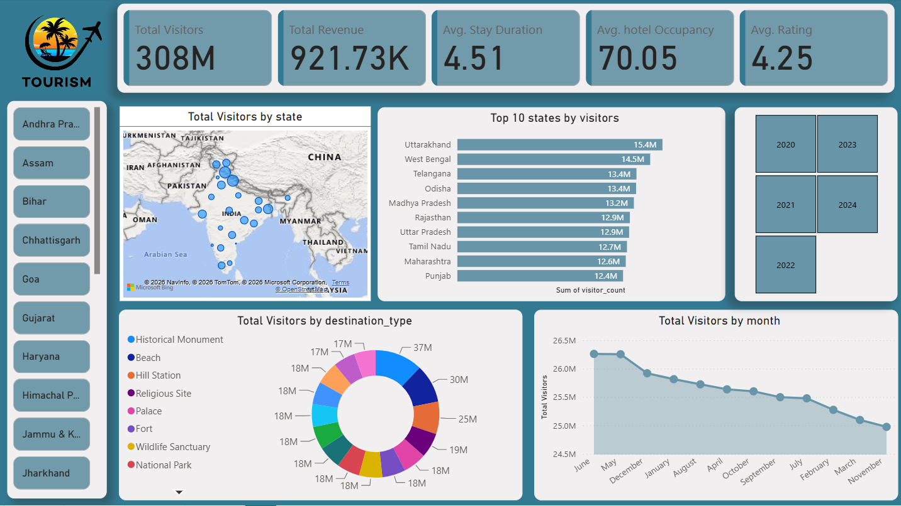
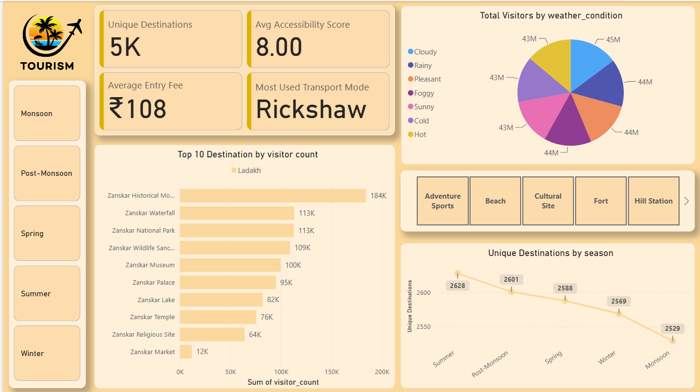
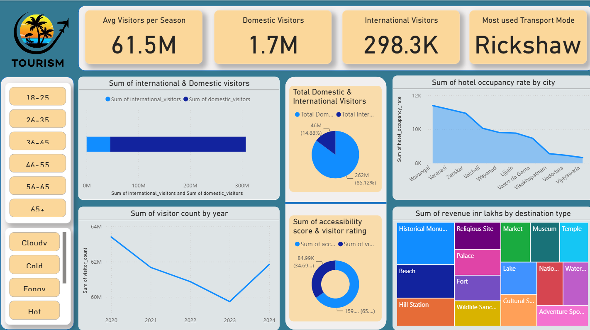

# 🇮🇳 India Tourism Insights Dashboard

An interactive **Power BI dashboard** developed to analyze India's tourism performance across states, destinations, seasons, years, and tourism categories. The dashboard transforms tourism data into meaningful visual insights covering visitor trends, revenue, ratings, hotel occupancy, destinations, transportation, and more.

## 🎯 Objective

The objective of this project is to build a data-driven Business Intelligence dashboard that helps users understand tourism patterns and explore key factors affecting tourism performance across India.

The dashboard provides an interactive way to analyze visitor behavior, destination popularity, revenue contribution, seasonal patterns, and other important tourism indicators.

## 📊 Key Performance Indicators

* 👥 **Total Visitors:** 308M
* 💰 **Total Revenue:** 921.73K
* ⭐ **Average Visitor Rating:** 4.25
* 🏨 **Average Hotel Occupancy:** 70.05
* 📍 **Unique Destinations:** 5K
* 💵 **Average Entry Fee:** ₹108
* 🚕 **Most Used Transport Mode:** Rickshaw
* 🌍 **International Visitors:** 298.3K
* 🇮🇳 **Domestic Visitors:** 1.7M

## 🔍 Dashboard Analysis

### 🗺️ Tourism Overview

The overview dashboard provides a high-level view of India's tourism performance, including:

* State-wise visitor distribution
* Top 10 states by visitor count
* Visitor trends by month
* Visitor distribution by destination type
* Major tourism KPIs
* Interactive state and year filters

### 🏝️ Destination & Seasonal Analysis

This section focuses on destination-level and seasonal tourism insights.

It includes:

* Top destinations by visitor count
* Unique destinations
* Average accessibility score
* Average entry fee
* Weather-condition analysis
* Destination categories
* Seasonal destination trends
* Transportation preferences

### 👥 Visitor & Revenue Analysis

This dashboard provides deeper analysis of visitor demographics, tourism trends, and revenue.

It includes:

* Domestic vs. international visitors
* Visitor trends by year
* Hotel occupancy by city
* Accessibility score vs. visitor rating
* Revenue by destination type
* Visitor analysis by age group
* Transportation analysis

## 🛠️ Tools & Technologies

* **Microsoft Power BI**
* **Power Query (M)**
* **DAX**
* Data Visualization
* Data Analysis
* Business Intelligence
* Interactive Dashboard Design

## 🔄 Data Transformation

**Power Query** was used for data preparation and transformation, including:

* Importing tourism data
* Promoting headers
* Setting appropriate data types
* Cleaning and transforming columns
* Replacing inconsistent values
* Preparing data for analysis

The Power Query M code used in the project is available in:

`PowerQuery_M_Code.txt`

## 🧮 DAX

Custom **DAX measures** were created to calculate and analyze important tourism metrics such as visitor percentages, averages, totals, and other dashboard KPIs.

The DAX measures used in the project are documented in:

`DAX_Measures.md`

## 📸 Dashboard Preview

### Tourism Overview



### Destination & Seasonal Analysis



### Visitor & Revenue Analysis



## 📁 Repository Structure

```text
India-Tourism-Insights-PowerBI/
│
├── README.md
├── Tourism_Dashboard[1].pbix
├── DAX_Measures.md
├── PowerQuery_M_Code.txt
│
├── tourism_overview.png
├── destination_seasonal_analysis.png
├── visitor_revenue_analysis.png
└── [additional dashboard screenshot]
```

## 🧠 What I Learned

This project provided practical experience in using Power BI for data analysis and Business Intelligence.

Through this project, I learned how to:

* Transform raw data into analysis-ready data
* Use Power Query for data cleaning and transformation
* Create calculated measures using DAX
* Design interactive dashboards
* Select appropriate visualizations for different types of data
* Build and present meaningful KPIs
* Analyze trends across time and seasons
* Perform geographical and destination-level analysis
* Compare domestic and international visitors
* Analyze revenue and hotel occupancy
* Present complex datasets through clear visual storytelling

One of my key takeaways was that an effective dashboard is not simply a collection of charts. It should present the **right information clearly and interactively** so that users can identify patterns and make data-driven decisions.

## 🚀 Future Improvements

Potential future improvements include:

* Adding more recent tourism data
* Connecting the dashboard to a live data source
* Adding automated data refresh
* Implementing tourism forecasting
* Adding more detailed destination-level analysis
* Publishing the dashboard through Power BI Service
* Adding additional business and economic indicators

## 📌 Project Files

**`Tourism_Dashboard[1].pbix`**
The main Power BI dashboard file.

**`PowerQuery_M_Code.txt`**
Contains the Power Query M code used for data preparation and transformation.

**`DAX_Measures.md`**
Contains the custom DAX measures used in the dashboard.

**Dashboard screenshots**
Provide a visual preview of the different analytical pages.

---

⭐ **This project was developed as part of my learning journey in Data Analytics and Business Intelligence.**
